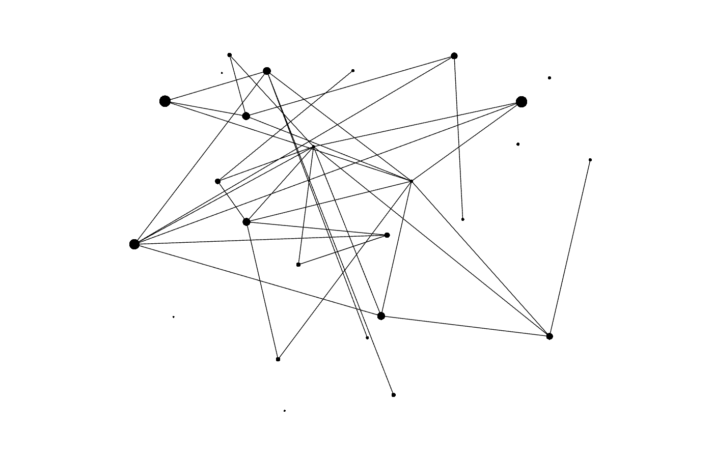

<p align="center">
   
</p>

# 🍝 Ragu.jl

## A graphical project explorer for MATLAB

Ragu (stylized Ragù) is a little Julia module that lets you explore function calls in MATLAB projects with the help of [Sigma.js](https://github.com/jacomyal/sigma.js). It allows you to see the connections between the different function and `.m` files using a more friendly network graph.

💅 Nodes are draggable by default

🕶 Use [Sigma.js](https://github.com/jacomyal/sigma.js) to personalize your graph

## Usage

1. Place `Ragu.jl` , `ragu.html` and the `js` folder into your MATLAB project folder

2. Open your shell/Terminal and start Julia with `julia`

3. Execute

   ```julia
   julia> include("Ragu.jl")
   julia> importall Ragu
   julia> saveJsonGraph()
   ```

4. Open `ragu.html` with your (modern) browser of choice!


## Contribute

This is is a *minuscule* project, but if you have any idea on how to make it better, please issue a [pull request](https://github.com/giob1994/ragu/pulls) with your changes.

